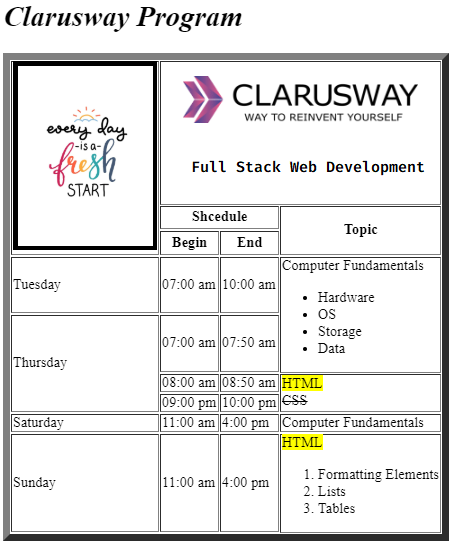

Clarusway

# Hands-On-01 : HTML Basics

Purpose of the this coding challenge is to learn HTML basics.

## Learning Outcomes

At the end of the this coding challenge, students will be able to;

- create a table,
- add images,
- add headings, sub-headings and paragraphs,
- use HTML formatting elements,
- use ordered and unordered lists.

## Problem Statement

- Write a code that creates an html time scheduler.

## Additional Resourses

- First picture's link [Image One](./original.jpg)
- Second picture's link [Image Two](https://clarusway.com/wp-content/uploads/2019/12/cw_sonk%C3%BC%C3%A7%C3%BCk2.png)

 &#8987; Happy Coding  &#9997; 

