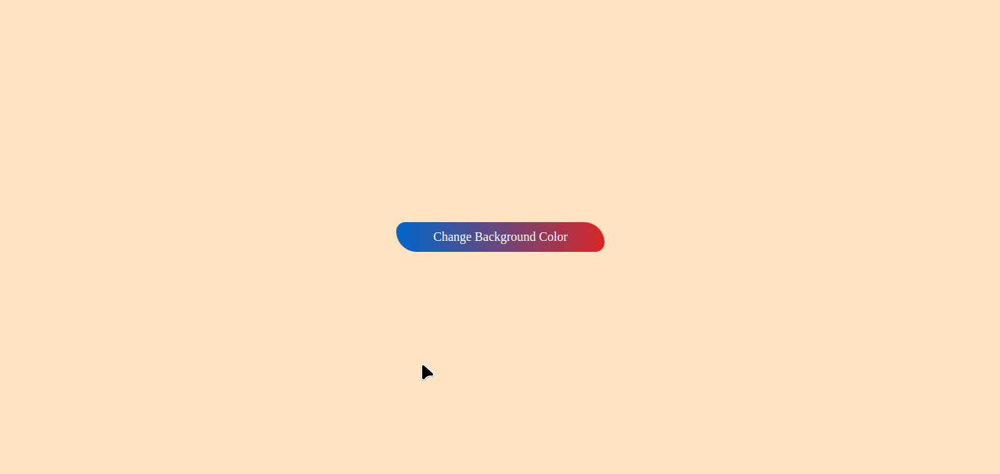

<h1 style="color:red;text-align:center;"> Change Random Background Color App</h1>

## Beklenenler
- Sayfanın ortasında bir buton oluşturulması ve bu butona bir event tanımlanması.
- Kullanıcı butona her tıkladığında arka plan renginin <b>random</b> değiştirilmesi.

### Bonus
- Her renk değişiminde oluşan rengin bilgilerinin ekranda gösterilmesi.

