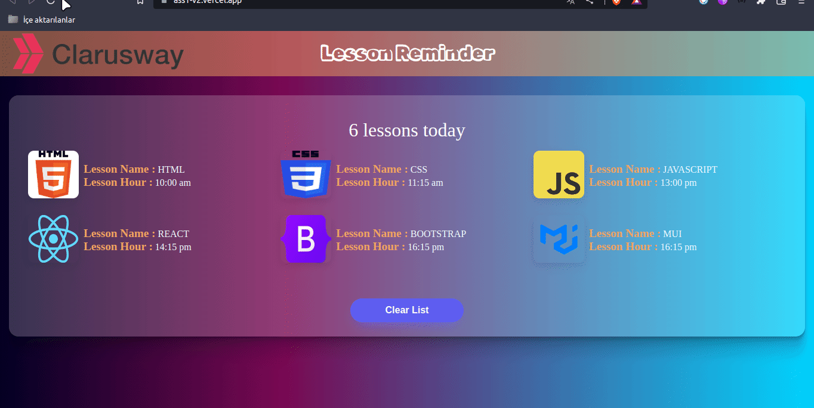

<p>Clarusway</p>

# Lesson Reminder

## Description

Project aims to create a Lesson Reminder App.

## Problem Statement

- We are adding a new project to our portfolios. So you and your colleagues have started to work on the project.

## Project Skeleton

```
Ass1-v2 - Lesson Reminder (folder)
|
|----readme.md         # Given to the students (Definition of the project)
SOLUTION
├── public
│     └── index.html
├── src
│    ├── App.js
│    ├── components
│    │   ├── Header
│    │   │   ├── Header.css
│    │   │   └── Header.jsx
│    │   └── LessonCard
│    │       ├── LessonCard.jsx
│    │       └── lesson.module.css
│    ├── helper
│    │   └── data.js
│    ├── pages
│    │   └── Lesson.jsx
│    ├── index.css
│    ├── index.js
├── package.json
└── package-lock.json

```

## Expected Outcome



## Objective

Build a Lesson Reminder App using ReactJS.

### At the end of the project, following topics are to be covered;

- HTML

- CSS

- JS

- ReactJS

### At the end of the project, students will be able to;

- improve coding skills within HTML & CSS & JS & ReactJS.

- use git commands (push, pull, commit, add etc.) and Github as Version Control System.

## Steps to Solution

- Step 1: Clone this repo and `npm install`.

- Step 2: Start the Lesson Reminder App `npm start`.

- Step 3: You can create the button element and define an event for it.

- Step 4: When a user clicks the button, the list is deleted.

- Step 5: Push your application into your own public repo on Github

- Step 6: Add project gif to your project and README.md file.

## Notes

- You can add additional functionalitiesto your app.

## Demo
  <a href="https://ass1-v2.vercel.app/" target="_blank">React Lesson Reminder</a>

**<p align="center">&#9786; Happy Coding &#9997;</p>**
